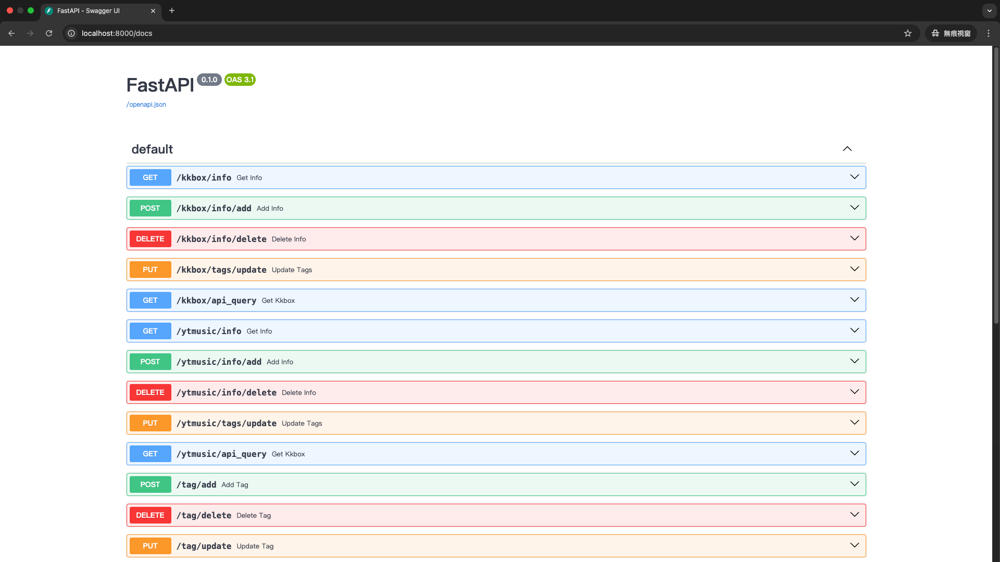

## Song La Backend

### Installation
1. 參考 [ytmusicapi OAuth authentication](https://ytmusicapi.readthedocs.io/en/stable/setup/oauth.html) 建立 oauth.json，並取得 client_id 及 client_secret。
2. 參考 [KKBOX Open API 文件](https://docs-en.kkbox.codes/docs#overview--step-1-create-the-application-client-id-and-client-secret) 取得 client_id 及 client_secret。
3. 將 1,2 的 client_id 及 client_secret 分別填入 `.env` 的對應變數。
4. 執行以下指令，建立後端及資料庫。
   ```sh
   docker compose up -d
   ```
5. 前往 <http://localhost:8000/docs>，即可看見以下畫面。
   